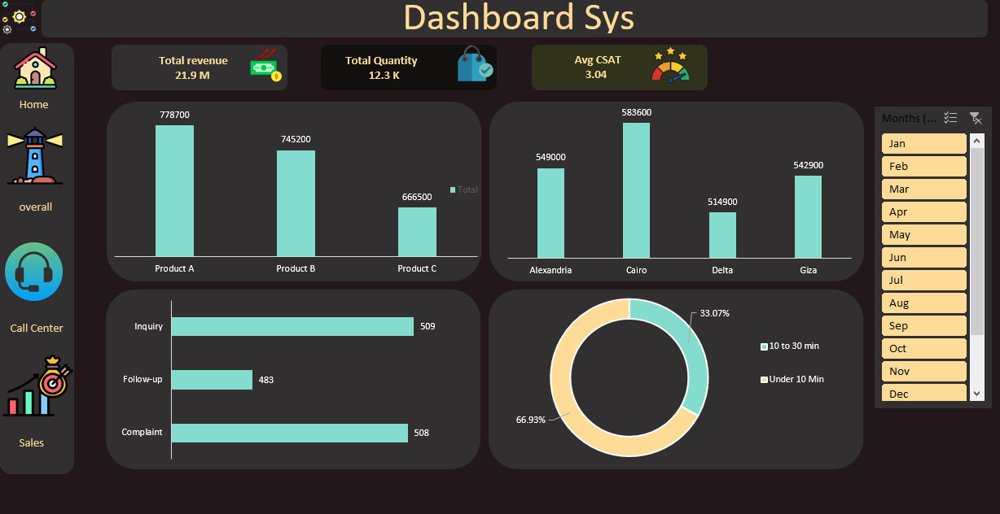
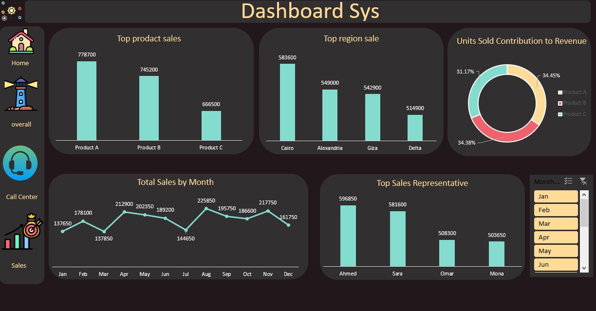
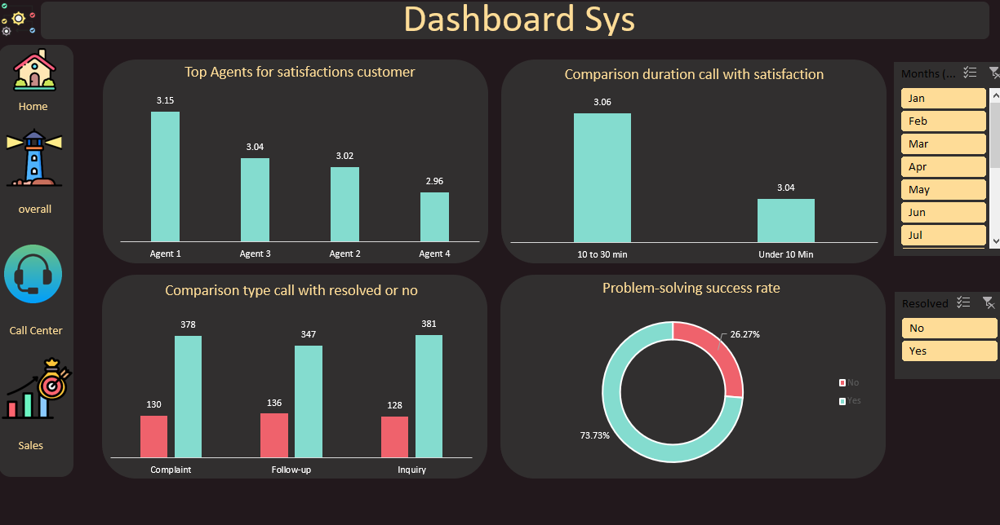

# 📊 Sales & Call Center Performance Dashboard

## 📌 Project Overview
This project provides a 360-degree view of business operations by analyzing two key areas:
1. **Sales Performance:** Tracking revenue, units sold, and top-performing regions/salespeople.
2. **Call Center Efficiency:** Monitoring call volumes, resolution rates, and customer satisfaction (CSAT).

## 🚀 Key Insights

### 💰 1. Overall Performance
A high-level summary of the business health, combining key metrics from both sales and operations.

---

### 📈 2. Sales Analysis Deep-Dive
- **Top Regions:** Identification of high-growth regions (Cairo, Alexandria, Giza, Delta).
- **Product Performance:** Analyzing revenue distribution across different products.
- **Monthly Trends:** Tracking sales fluctuations to identify peak seasons.

---

### 📞 3. Call Center Efficiency
- **Service Quality:** Measuring Average Customer Satisfaction across different agents.
- **Operational Efficiency:** Analyzing call durations and their impact on resolution.
- **Problem Solving:** Tracking the success rate of resolved vs. unresolved issues.

## 🛠️ Tech Stack
- **Microsoft Excel:** Data Cleaning, Power Query, Pivot Tables, and Dashboarding.
- **Data Modeling:** Combining multiple data sources for a unified business view.

## 📁 Repository Structure
- `Data/`: Raw and cleaned datasets.
- `Dashboard/`: Visual representation and screenshots of the interactive dashboard.

---
**Developed by Abdelrahman Ibrahim**
